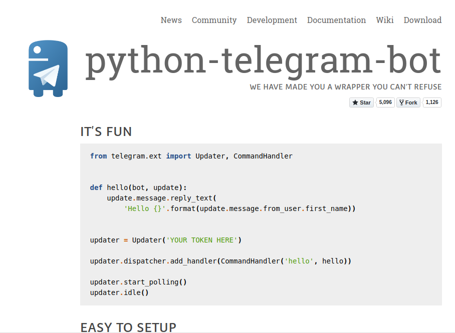

# Documento de Visão

Histórico de Revisão

| Data | Versão | Descrição | Autor\(es\) |
| --- | --- | --- |
| 11/06/2018 | 1.0 | Introdução | Thiago Ribeiro |
| 12/06/2018 | 2.0 | Introdução, Posicionamento,  Descrição do usuário, Envolvidos e Visão Geral | Thiago Ribeiro |

## Índice

### 1. Introdução

1.1 Objetivos

1.2 Escopo

1.3 Visão geral do documento

1.4 Referências

### 2. Posicionamento

2.1 Oportunidade de Negócios

2.2 Descrição do problema

2.3 Sentença de Posição do Produto

### 3. Descrição do usuário

3.1 Usuário

3.2 Principais necessidades do usuário

3.3 Ambiente do usuário

3.4 Alternativas e competição

### 4. Envolvidos

### 5. Visão geral do produto

5.1 Perspectiva do produto

5.2 Recursos do produto

## 1. Introdução

### 1.1 Objetivos

O objetivo deste documento é explicar e esclarecer a respeito do escopo do projeto, auxiliando os desenvolvedores e leitores a entender a proposta do produto e também é objetivo deste documento introduzir o posicionamento do software frente ao problema a se solucionar, aos seus usuário e ao público em que se encontra.

### 1.2 Escopo

Podemos encontrar atualmente diversos serviços nos quais possuem mão de obra humana que podem ser substituído por um serviço automatizado. Diante desse quadro e mais alguns aspectos o LoremBot busca ser uma solução em busca da excelência de um serviço aos clientes e uma solução econômica aos empreendedores através de um framework de chatbots que facilita o desenvolvedor a criar um bot nos quais satisfaça as suas necessidades com praticidade.

### 1.3 Visão Geral do Documento

Este documento contém detalhes a respeito das características do sistema a ser desenvolvido, esclarecendo os problemas que se busca mitigar e como as soluções propostas atendem a esses requisitos. A organização deste documento se dá da seguinte maneira: inicialmente estão esclarecidas as razões que influenciaram o desenvolvimento da aplicação, assim como a descrição dos envolvidos. E por fim são descritos os recursos do produto e suas funcionalidades.

### 1.4 Referências

#### Encontradas no [Bot Code Examples](https://core.telegram.org/bots/samples) do Telegram 

python-telegram-bot &lt;[https://python-telegram-bot.org](https://python-telegram-bot.org/)/&gt; Acesso em: 12/06/2018

Telepot &lt;[https://github.com/nickoala/telepot](https://github.com/nickoala/telepot)&gt; Acesso em: 12/06/2018

AIOGram &lt;[https://github.com/aiogram/aiogram](https://github.com/aiogram/aiogram)&gt; Acesso em: 12/06/2018

twx.botapi &lt;[https://github.com/botstan/API](https://github.com/botstan/API)&gt; Acesso em: 12/06/2018

## 2. Posicionamento

### 2.1 Oportunidade de Negócios

Um bom serviço de atendimento no qual esteja isento de mal entendidos e também eventuais erros e enganos do homem parece ser impossível.  Entretanto este é o serviço no qual os empreendedores e clientes demasiadamente desejam e é o serviço que um chatbot bem desenvolvido pode oferecer. Diante da consequência desse cenário é um serviço que também concede uma enorme economia e escalabilidade aos empreendedores. O lorembot visa contribuir para esse serviço, serviço no qual tem mudado a forma de atendimento no mundo, o lorembot busca fortalecer esse segmento de atendimento através da disponibilização de um framework que conecta desenvolvedores a um ambiente no qual o possibilita construir um chatbot com mais agilidade e praticidade. 

### 2.2 Descrição do Problema

| **O problema seria** | a complexidade de desenvolver um chatbot do zero para realizar um bom serviço |
| --- | --- | --- | --- |
| **que afeta** | as pessoas que recebem atendimento de serviços, desenvolvedores e empreendedores |
| **cujo impacto é** | perda de tempo em um atendimento, ineficiência de um atendimento humano não qualificado, custo do desenvolvedor, custo do empreendedor. |
| **e uma boa solução seria** | um framework no qual permite e auxilie o desenvolvimento de um chatbot que mais se enquadre com a necessidade dos stakehoulders |

### 2.3 Sentença de Posição do Produto

| **Para** | os desenvolvedores de chatbots |
| --- | --- | --- | --- | --- | --- |
| **que** | estão interessados em encontrar uma maneira mais fácil e adequada de construir um chatbot |
| **o LoremBot** | é um Framework  |
| **que** | auxilia o desenvolvimento de chatbots |
| **diferente de** | chatbots que já estão concluídos e disponibilizados para o cliente que tão somente o usa sem customiza-lo. |
| **nosso produto** | oferece uma maneira de desenvolver um chatbot de maneira mais ágil e customizável |

## 3. Descrição do Usuário

### 3.1 Usuário

| **Nome** | **Descrição** | **Responsabilidades** |
| --- | --- |
| Desenvolvedor | Pessoa interessada em construir um chatbot  | Utilizar as funcionalidades oferecidas pelo lorembot para o chatbot desejado |

### 3.2 Principais necessidades do usuário

| **Necessidade** | **Problema** | **Solução Proposta** | **Solução Atual** |
| --- | --- |
| O desenvolvedor tem a necessidade de construir um chatbot de acordo com as suas especificações | A complexidade de construir um chatbot do zero para satisfazer as suas especificações | Um framework no qual o desenvolvedor encontra a possibilidade de construir um chatbot com suas especificações com mais facilidade | O desenvolvedor pode construir um chatbot do zero, assim tendo um trabalho com um maior custo e tempo |

### 3.3 Ambiente do usuário

O lorembot é aplicado no desenvolvimento do chatbot,  no qual é usado como um pacote \(que pode ser instalado via pip ou obter o pacote apartir do repositório oficinal do [LoremBot](https://github.com/DSW12018/LoremBot) \) que deve ser importado através de algum editor de texto qualquer\(Vim, NeoVim, gedit, atom, sublime, vscore, ect . . .\). 

### 3.4 Alternativas e competição

#### 3.4.1 python-telegram-bot

O python-telegram-bot é um pacote que possibilita a criação de bot's

## 4. Envolvidos

| **NOME** | **DESCRIÇÃO** | **PRINCIPAIS RESPONSABILIDADES** |
| --- | --- | --- | --- | --- | --- | --- |
| Breno Mariz | Membro da equipe de desenvolvimento | Executar o projeto, além de desenvolver e manter a documentação e o software. |
| Igor Gabriel | Membro da equipe de desenvolvimento. | Executar o projeto, além de desenvolver e manter a documentação e o software. |
| Indiara Duarte | Membro da equipe de desenvolvimento. | Executar o projeto, além de desenvolver e manter a documentação e o software. |
| Kairon Velozo | Membro da equipe de desenvolvimento. | Executar o projeto, além de desenvolver e manter a documentação e o software. |
| Thiago Ribeiro | Membro da equipe de desenvolvimento. | Executar o projeto, além de desenvolver e manter a documentação e o software. |
| Profª. Milene Serrano | Orientadora e Avaliadora do Projeto  | Acompanhar, avaliar e orientar o desenvolvimento do projeto. |

## 5. Visão geral do Produto

### 5.1 Perspectiva do produto

 O lorembot tem como objetivo proporcionar uma maneira mais simples e prática ao desenvolvedor que busca construir chatbots no Telegram.

### 5.2 Recursos do produto

* Configurar Token: Possibilita que o usuário tenha permissões de utilizar o serviço com o token oferecido pelo BotFather do telegram.

