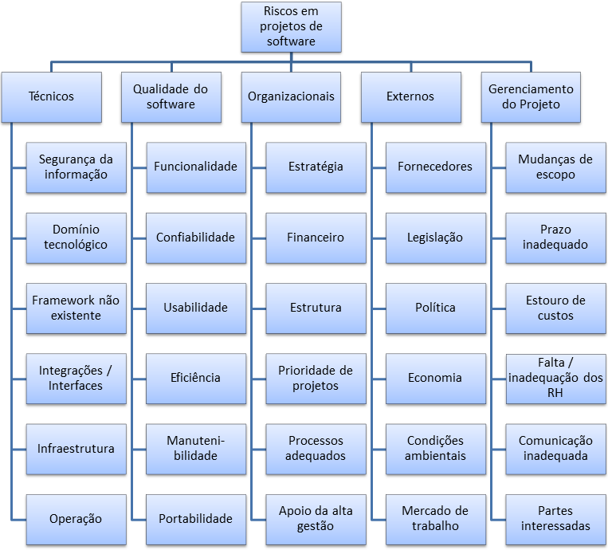

# Plano de Riscos

Histórico de Revisão

| **Data** | **Descrição** | **Autor\(es\)** |
| --- | --- | --- |
| 12/06/2018 | Introdução | Thiago Ribeiro |
| 14/06/2018 | Categoria dos Riscos\(EAR\) | Thiago Ribeiro |

## 1. Introdução

Segundo o PMI \(2013\), risco é um evento ou uma condição incerta que, se ocorrer, provocará um efeito positivo ou negativo nos objetivos do projeto tais como custo, escopo, prazo ou qualidade. Tendo em vista isso, este planejamento de riscos tem como finalidade elicitar os possíveis riscos do projeto para que eles sejam priorizados e também buscar as medidas que consideraremos que seja bom tomar caso qualquer um dos deles aconteçam. Buscando reduzir a probabilidade de insucesso em uma pequena etapa e consequentemente reduzindo a probabilidade de insucesso do projeto. Deve-se considerar que há uma inexperiência na equipe com o escopo do lorembot no qual impossibilita prever com exatidão os riscos nos quais podem ser incrementado durante o projeto.

## 2. Estrutura Analítica de Riscos \(EAR\)

A EAR permite identificar temas recorrentes e áreas de concentração de riscos, além de servir como um guia para o processo de gestão de riscos.

### 2.2 Categoria dos Riscos

Os riscos podem ser definidos em algumas categorias, nos quais serão adaptadas para o cenário da equipe, segue abaixo a descrição de cada risco que o desenvolvimento do LoremBot está suscetível a sofrer.

#### 2.2.1 Técnicos

|  | **Técnico** |
| --- | --- | --- | --- | --- | --- | --- |
| **Segurança da informação** | Categoria que se refere aos riscos que envolvem a possível falta de integridade dos dados e seu sigilo.  |
| **Domínio Tecnológico** | Categoria que se refere aos riscos que envolvem a tecnologia a ser utilizada, seus limites, acessibilidade e ambiente. |
| **Framework não existente** | Categoria que se refere a falta de um framework para o auxilio do desenvolvimento de um outro framework, um produto ou aplicações derivadas. |
| **Integrações/Interfaces** | Categoria que se referente ao riscos que envolvem a integração de um ou mais componentes para o desenvolvimento. |
| **Infraestrutura** | Categoria de riscos que envolvem a dependência da equipe em relação a infraestrutura a ser utilizada, suas limitações, acessibilidade e a cooperação do suporte dos responsáveis. |
| **Operação** | Categoria de risco que envolva perdas resultantes de falha, deficiência ou inadequação de processos internos, pessoas e sistemas, ou de eventos externos. |

#### 2.2.2 Qualidade do Software

|  | **Qualidade do Software** |
| --- | --- | --- | --- | --- | --- | --- |
| **Funcionalidade** | Riscos que envolve a capacidade do programa. |
| **Confiabilidade** | Categoria de risco que envolve se o software é previsível ou seja se funciona conforme o esperado ou prometido, se é consistente e se ele contém um número minimo de erros. |
| **Usabilidade** | Categoria de risco que envolve a quantidade que o usuário se esforça para aprender\(sua curva de aprendizado\) e operar o software.  |
| **Eficiência e Eficácia** | O risco que envolve se o software faz o que se espera dele e com a  velocidade proposta. |
| **Manutenibilidade** | O risco que envolve se o software é desenvolvido com padrões de projetos, técnicas de programação ou eventuais medidas que proporcione uma manutenibilidade com menor custo. |
| **Portabilidade** | O risco que envolve se o software alcança a portabilidade do seu uso desejada, nos respectivos ambientes propostos.  |

#### 2.2.3 Organizacionais

|  | **Organizacionais** |
| --- | --- | --- |
| **Dependências** | Categoria que envolve se a equipe contém todas as dependências satisfeitas para a continuidade do desenvolvimento, como a sua documentação confeccionada e validada. |
| **Recursos** | Categoria que se refere aos riscos que envolvem os recursos do projeto, recursos tecnológicos e humanos. Tais como os computadores e ambiente de trabalho para que todos possam trabalhar e a gestão de pessoas que envolve a motivação, integração e produtividade da equipe. |

#### 2.2.4 Externos

|  | **Externos** |
| --- | --- | --- |
| **Universidade** | Categoria que se refere aos riscos do ambiente no qual a disciplina de Arquitetura e Desenho de Software e em que os alunos/equipe estão inseridos. |
| **Stakehoulders** | Categoria que diz respeito se os clientes estão satisfeitos com o projeto. |

#### 2.2.5 Gerenciamento do Projeto

|  | **Gerenciamento do Projeto** |
| --- | --- | --- | --- | --- |
| **Estimativa** | Categoria que se refere aos riscos que envolvem as estimativas do projeto, como cronograma, custos e esforços. |
| **Planejamento** | Categoria que se refere aos riscos que envolvem o planejamento em geral: os recursos, riscos, sprints, etc... |
| **Controle** | Categoria que se refere aos riscos que envolvem o controle e o monitoramento do projeto e sua equipe. |
| **Comunicação** | Categoria que se refere aos riscos decorrentes da falha ou sucesso da comunicação. |

## 3. Identificação dos Riscos

Os riscos podem ser identificados de várias formas, porém quanto mais cedo os riscos são identificados mais tempo a equipe de gerenciamento tem para gerência-los, desde então segue abaixo o documento dos risco já identificados com suas respectivas categorias:

| **ID** | **Se** | **por conta**  | **o impacto será** | **Categoria \(EAR\)** |
| --- | --- | --- | --- | --- |
| RN01 | Saída de algum membro da equipe | de motivos diversos | menos recursos para o desenvolvimento do projeto | Organizacionais |
| RN02 | A equipe não tiver um bom domínio da tecnologia | da falta de experiencia da equipe | Mais esforço e custo  | Técnico |
| RN03 | Membros cursando muitas disciplinas | de querer acelerar a conclusão do curso e motivos diversos | o tempo dedicado ao projeto | Organizacionais |
| RN04 | A equipe não conseguir desenvolver a arquitetura | da falta de experiência da equipe  | o projeto não ser entregue como o esperado | Técnico |

