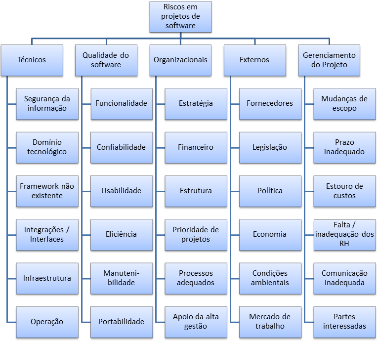

# Plano de Riscos

Histórico de Revisão

| **Data** | **Descrição** | **Autor\(es\)** |
| --- | --- |
| 12/06/2018 | Introdução | Thiago Ribeiro |

## 1. Introdução

Segundo o PMI \(2013\), risco é um evento ou uma condição incerta que, se ocorrer, provocará um efeito positivo ou negativo nos objetivos do projeto tais como custo, escopo, prazo ou qualidade. Tendo em vista isso, este planejamento de riscos tem como finalidade elicitar os possíveis riscos do projeto para que eles sejam priorizados e também buscar as medidas que consideraremos que seja bom tomar caso qualquer um dos deles aconteçam. Buscando reduzir a probabilidade de insucesso em uma pequena etapa e consequentemente reduzindo a probabilidade de insucesso do projeto. Deve-se considerar que há uma inexperiência na equipe com o escopo do lorembot no qual impossibilita prever com exatidão os riscos nos quais podem ser incrementado durante o projeto.

## 2. Estrutura Analítica de Riscos \(EAR\)

A EAR permite identificar temas recorrentes e áreas de concentração de riscos, além de servir como um guia para o processo de gestão de riscos.

### 2.2 Categoria dos Riscos

Os riscos podem ser definidos em algumas categorias, segue abaixo a descrição de cada risco que o desenvolvimento do LoremBot está suscetível a sofrer.

#### 2.2.1 Técnicos

|  | **Técnico** |
| --- | --- | --- | --- | --- | --- | --- |
| **Segurança da informação** | Categoria que se refere aos riscos que envolvem a possível falta de integridade dos dados e seu sigilo.  |
| **Domínio Tecnológico** | Categoria que se refere aos riscos que envolvem a tecnologia a ser utilizada, seus limites, acessibilidade e ambiente. |
| **Framework não existente** | Categoria que se refere a falta de um framework para o auxilio do desenvolvimento de um outro framework, um produto ou aplicações derivadas. |
| **Integrações/Interfaces** | Categoria que se referente ao riscos que envolvem a integração de um ou mais componentes para o desenvolvimento. |
| **Infraestrutura** | Categoria de riscos que envolvem a dependência da equipe em relação a infraestrutura a ser utilizada, suas limitações, acessibilidade e a cooperação do suporte dos responsáveis. |
| **Operação** | Categoria de risco que envolva perdas resultantes de falha, deficiência ou inadequação de processos internos, pessoas e sistemas, ou de eventos externos. |

