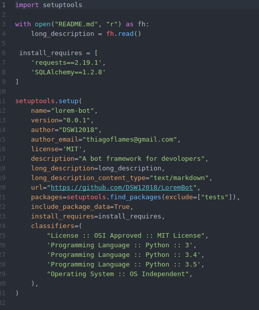
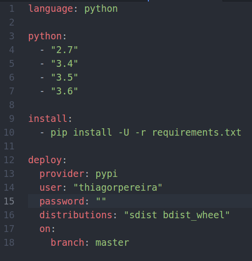

# Empacotamento

## 1. Introdução

  
O empacotamento do microframework LoremBot foi feito seguindo os tutoriais fornecidos comunidade python [PyPi](https://packaging.python.org/tutorials/distributing-packages/#uploading-your-project-to-pypi),  atravez do _The Python Package Index \(_[_PyPi_](https://packaging.python.org/)_\)_ foi possível realizar distribuição do framework através do instalador pip utilizado amplamente pelos desenvolvedores python.

### 2. Ferramentas usadas para empacotamento


* Python - Utilizado para empacotar o projeto em .tar.gz e .whl , comando utilizado:

```text
python3 setup.py sdist bdist_wheel
```

* Twine - Utilizado para subir o empacotamento para a comunidade [PyPi](https://packaging.python.org/)

```text
twine upload dist/*
```

## 3. Configurações utilizadas



## 4. Deploy Pypi

Através de uma configuração no .travis.yml, quando a branch master receber uma nova integração será realizado o deploy no pypi e uma nova distribuição lorem-bot será realizada.

### 4.1 Configurações utilizadas

Arquivo .travis.yml



